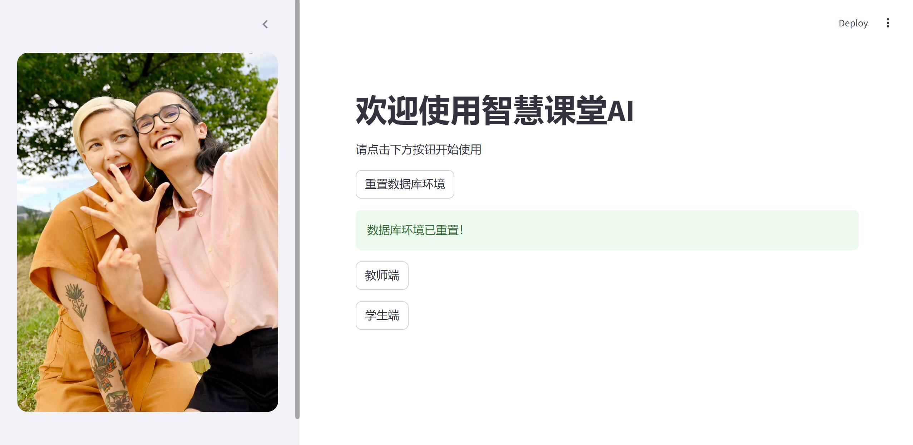

# 智慧课堂AI：AI助力课堂教学
本项目为2024年浙软夏令营项目二，通过调用ChatGPT模型，实现了根据个人知识库和课堂实时信息，生成课堂教学建议的功能。
使用streamlit搭建了一个简单的web应用，用户可以输入个人知识库、学生名单、学生回答等课堂实时信息 ，模型会根据这些信息生成课堂教学建议。


## 使用方法
进入 项目二-AI助力课堂教学/项目2-大模型应用创意设计 文件夹，设置好config.py里的参数（需获得Chatgpt API和可远程连接的MySQL数据库），然后按以下步骤运行代码，
1. 安装依赖
```bash
pip install -r requirements.txt
```
2. 导入个人知识库
在`data`目录下新建一个文件夹，以pdf文件的形式导入个人知识库。将此文件夹的路径写入`config.py`文件中的`file_dir`变量。
如果需要导入自己的知识库和学生名单等数据，需要将远程数据库中所有数据清空，再将学生名单导入students表。
3. 存储向量数据库
运行`prepare.py`文件，将个人知识库中的所有pdf文件转换为向量，
并存储到`config.py`中`save_embeddings_dir`变量指定的路径下。
4. 运行web应用
```bash
streamlit run frontend.py
```
在浏览器中打开`http://localhost:8501/` ，按照提示使用（按键需要按两次页面才会跳转）。
